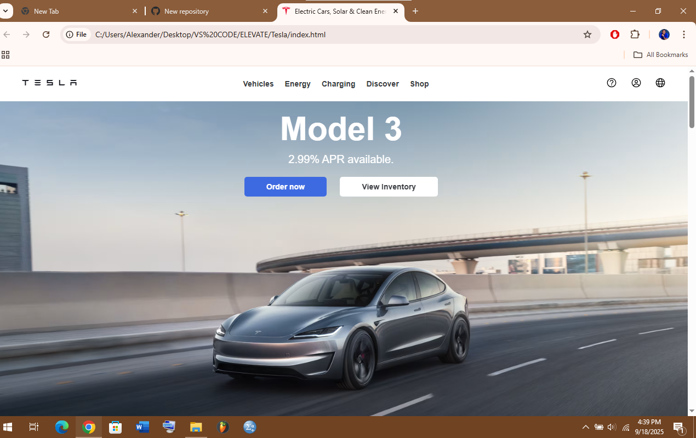

# Tesla-Landing-Page
##  Preview

# Tesla Landing Page Clone 

This is a practice project where I recreated a simplified version of the Tesla website landing page using **HTML** and **CSS** only.  

The goal was to improve my skills in:
- Structuring clean, semantic HTML
- Styling and layout using CSS (Flexbox)
- Using images, videos, and icons in a real-world project
- Building a visually appealing page similar to a live brand site  

---

## Technologies Used
- **HTML5**
- **CSS3 (Flexbox & Custom Styling)**
